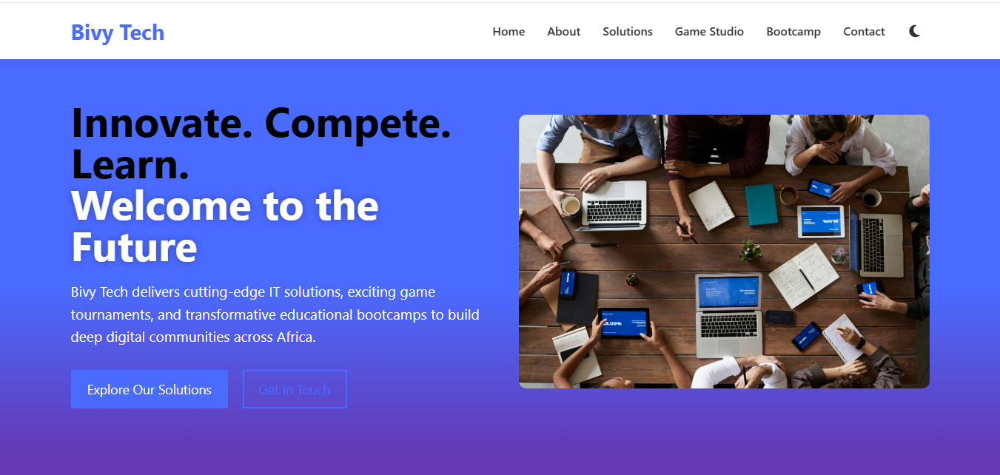

# Level 1 Frontend Task: BivyTech Landing Page Clone

## Credits 
This project is a **learning exercise** and unofficial clone of the original [BivyTech](https://bivytech.space) website.

📝 **Task Origin**:  
This project was completed as part of a frontend development project from [BivyTech](https://bivytech.space).

💻 **My Implementation**:  
- 100% original code written by EMMANUEL UDODIRIM 
- Created following assignment guidelines  
- Does not contain proprietary BivyTech code  

🖼️ **Assets Used**:  
- All visual elements recreated from scratch  
- Placeholder images from [Unsplash](https://unsplash.com)  
- Placeholder images from [Bivytech](https://www.bivytech.space/)  
- Icons from [Font Awesome Free](https://fontawesome.com)  

📜 **Submission Context**:  
Created for educational purposes as part of BivyTech's recruitment/assessment process. Not affiliated with BivyTech's official products.

---

## Disclaimer

This repository contains my original work completed for a BivyTech assignment. All company names and related imagery are used for descriptive purposes only. No copyright infringement intended.

For assignment verification:  
🔗 [Original Task Brief](#) *(https://sytyatsquad1.slack.com/archives/C091U8A0S20/p1753030671365739)*  
📅 Submitted on: [July, 2025]  

## Project Overview
A responsive clone of the [BivyTech](https://bivytech.space) landing page, featuring:
- Semantic HTML5 structure
- Mobile-first responsive design
- Dark/light theme switcher
- CSS hover animations
- Clean component-based architecture

## Live Demo
🔗 [View on GitHub Pages](https://emmytronix.github.io/Level1_Frontend_LandingPage_Emmanuel_Udodirim/)

✅ Responsive layout (mobile, tablet, desktop)  
✅ Dark/light mode toggle with CSS variables  
✅ Interactive hover animations on buttons  
✅ Semantic HTML structure  
✅ Accessible design principles  

## Technologies Used
- **HTML5** - Semantic document structure
- **CSS3** - Flexbox, Grid, Variables, Media Queries
- **JavaScript** - Theme switching functionality
- **Git/GitHub** - Version control and deployment
